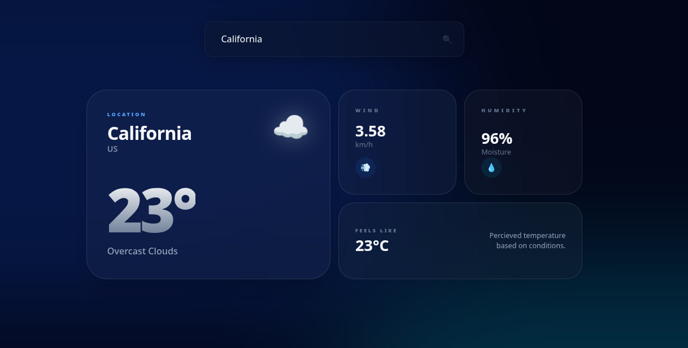

# SkyCast — Ultra-Modern Weather Dashboard

SkyCast is a premium weather analytics platform that combines (Bento-grid & Glassmorphism) with high-end React architecture.



## 🚀 Project Overview
This project was developed to move beyond simple API fetching and master **Server-State Management**. It demonstrates a deep understanding of how to handle asynchronous data, caching, and performance optimization in a real-world scenario.

### 🧠 The Technical Story
Most junior developers rely on `useEffect` for data fetching, which leads to messy code and poor performance. **SkyCast** solves this by implementing:
- **TanStack Query (React Query):** For automatic caching, background re-fetching, and "Out-of-the-box" loading/error states.
- **Axios Instances:** A centralized API configuration using a "Bodyguard" pattern to handle base URLs and secure API parameters.
- **Custom Hook Architecture:** Logic is completely decoupled from the UI using `useWeather` and `useDebounce` hooks, making the components "dumb" and easy to maintain.

## 🛠️ Key Features
- **Intelligent Debouncing:** Custom `useDebounce` hook limits API calls during user input to reduce server load and cost.
- **Request Deduplication:** TanStack Query prevents multiple identical network requests if the user spams the search action.
- **Dynamic Atmosphere:** The entire UI changes its ambient mesh gradient based on the temperature and weather condition.
- **2025 Bento UI:** A highly responsive grid layout inspired by high-end SaaS products, featuring glassmorphism and backdrop-blur effects.

## 💻 Tech Stack
- **Framework:** React (Vite)
- **Data Layer:** TanStack Query & Axios
- **Styling:** Tailwind CSS (Bento Grid, Glassmorphism, Mesh Gradients)
- **State Logic:** Custom Hooks & Functional Programming

## ⚙️ Setup & Security
To run this project locally, you must provide your own API Key from OpenWeatherMap.

1. Create a `.env` file in the root directory.
2. Add your key:
   ```env
   VITE_WEATHER_API_KEY=your_actual_api_key_here